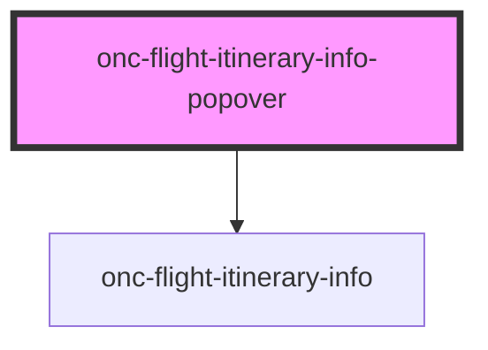

# onc-flight-itinerary-info-popover

A component for showing specific flight itinerary's more detailed information in a popover.

Internally uses [Popper](https://popper.js.org/) to position the popover.

## Usage

```tsx
const itineraryOncarbonId =
  "MzIwLkhFTC5CQ04uQVkuMTY1My4yMDIyLTAyLTAzVDE3OjA1OjAwfjMyMC5CQ04uTEhSLkJBLjQ3NS4yMDIyLTAyLTA3VDE0OjE1OjAwITMyQi5MSFIuSEVMLkFZLjEzMzguMjAyMi0wMi0wN1QxODoxMDowMA~QCb6wPo1TONm9qttwnfkpWu9Teo";

<onc-flight-itinerary-info-popover itinerary-oncarbon-id={itineraryOncarbonId}>
  <button>Open the popover</button>
</onc-flight-itinerary-info-popover>;
```

## Opening the popover

The popover needs a trigger element whose click will open the popover. The trigger element can be defined in couple ways:

### 1. Using the `trigger` property

The `trigger` property can be either DOM selector `string` (e.g. `.trigger`) or a `HTMLElement` directly.

### 2. Using the DOM structure

If no `trigger` property is given, the component decides the trigger element based on the DOM structure in the following order:

1. First element wrapped inside the component. E.g.

```html
<onc-flight-itinerary-info-popover>
  <button>Clicking me will open the popover</button>
</onc-flight-itinerary-info-popover>
```

2. Component's previous sibling element

```html
<div>
  <button>Clicking me will open the popover</button>
  <onc-flight-itinerary-info-popover></onc-flight-itinerary-info-popover>
</div>
```

3. Component's parent element

```html
<button>
  <onc-flight-itinerary-info-popover></onc-flight-itinerary-info-popover>
  Clicking me will open the popover
</button>
```

The popover can also be opened programmatically by calling `.open()` method on the element.

## Closing the popover

The popover is closed by

1. clicking outside the popover element
2. clicking the close icon
3. calling `.close()` method on the element.

## Positioning the popover

The popover positioning varies depending on the viewport width. On small screen sizes (below 768px) it is positioned in the middle of the screen. On screen sizes above that, it is positioned in reference to the trigger element. See [the section above](#opening-the-popover) how to define the trigger element. The `placement` and `offset` properties define how the popover is positioned relative to the trigger element.

<!-- Auto Generated Below -->


## Properties

| Property              | Attribute               | Description                                                                                                                                                                                                                                                                             | Type                                                                                                                                                                                                         | Default     |
| --------------------- | ----------------------- | --------------------------------------------------------------------------------------------------------------------------------------------------------------------------------------------------------------------------------------------------------------------------------------- | ------------------------------------------------------------------------------------------------------------------------------------------------------------------------------------------------------------ | ----------- |
| `apiBaseUrl`          | `api-base-url`          | Oncarbon API base URL where the info is loaded from                                                                                                                                                                                                                                     | `string`                                                                                                                                                                                                     | `undefined` |
| `itineraryOncarbonId` | `itinerary-oncarbon-id` | Oncarbon ID for the flight itinerary whose info is to be shown                                                                                                                                                                                                                          | `string`                                                                                                                                                                                                     | `undefined` |
| `language`            | `language`              | Optional RFC 5646 language tag in which the info is shown. Supported languages are english and finnish. If an unsupported language tag is given, english is used as a fallback.                                                                                                         | `string`                                                                                                                                                                                                     | `"en"`      |
| `offset`              | --                      | The offset lets you displace the popover element from its reference element. See https://popper.js.org/docs/v2/modifiers/offset/#options                                                                                                                                                | `[number, number]`                                                                                                                                                                                           | `[0, 10]`   |
| `placement`           | `placement`             | Describes the preferred placement of the popover. See https://popper.js.org/docs/v2/constructors/#placement                                                                                                                                                                             | `"auto" \| "auto-end" \| "auto-start" \| "bottom" \| "bottom-end" \| "bottom-start" \| "left" \| "left-end" \| "left-start" \| "right" \| "right-end" \| "right-start" \| "top" \| "top-end" \| "top-start"` | `"bottom"`  |
| `trigger`             | `trigger`               | Optional trigger element that opens the popup and in reference to which the popover is positioned. Can either be a 1. a DOM selector string, such as .trigger-button 2. a HTML element  If none is given, the popover is triggered and positioned by the first child of this component. | `HTMLElement \| string`                                                                                                                                                                                      | `undefined` |


## Methods

### `close() => Promise<void>`

Closes the popover

#### Returns

Type: `Promise<void>`


### `open() => Promise<void>`

Opens the popover

#### Returns

Type: `Promise<void>`


## Dependencies

### Depends on

- [onc-flight-itinerary-info](../flight-itinerary-info)

### Graph


----------------------------------------------

*Built with [StencilJS](https://stenciljs.com/)*
