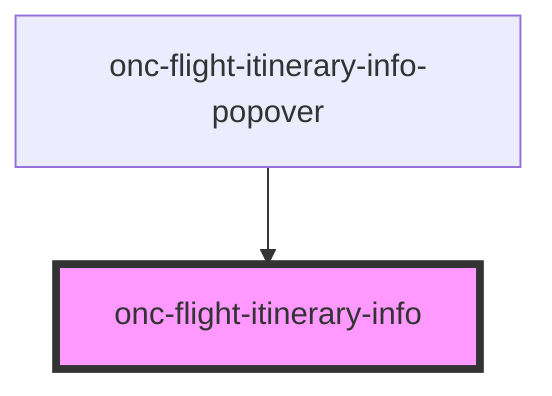

# onc-flight-itinerary-info

A component for showing specific flight itinerary's more detailed information.

## Usage

```tsx
const itineraryOncarbonId =
  "MzIwLkhFTC5CQ04uQVkuMTY1My4yMDIyLTAyLTAzVDE3OjA1OjAwfjMyMC5CQ04uTEhSLkJBLjQ3NS4yMDIyLTAyLTA3VDE0OjE1OjAwITMyQi5MSFIuSEVMLkFZLjEzMzguMjAyMi0wMi0wN1QxODoxMDowMA~QCb6wPo1TONm9qttwnfkpWu9Teo";

<onc-flight-itinerary-info itinerary-oncarbon-id={itineraryOncarbonId}></onc-flight-itinerary-info>;
```

<!-- Auto Generated Below -->


## Properties

| Property              | Attribute               | Description                                                                                                                                                                     | Type     | Default                      |
| --------------------- | ----------------------- | ------------------------------------------------------------------------------------------------------------------------------------------------------------------------------- | -------- | ---------------------------- |
| `apiBaseUrl`          | `api-base-url`          | Optional base URL for the Oncarbon API where the info is loaded from                                                                                                            | `string` | `"https://api.oncarbon.app"` |
| `itineraryOncarbonId` | `itinerary-oncarbon-id` | The flight itinerary's oncarbon id for which to show the info                                                                                                                   | `string` | `undefined`                  |
| `language`            | `language`              | Optional RFC 5646 language tag in which the info is shown. Supported languages are english and finnish. If an unsupported language tag is given, english is used as a fallback. | `string` | `"en"`                       |


## Events

| Event          | Description                                                  | Type                |
| -------------- | ------------------------------------------------------------ | ------------------- |
| `closeClicked` | Event emitted when the close icon has been clicked           | `CustomEvent<void>` |
| `loadingReady` | Event emitted when the flight itinerary info has been loaded | `CustomEvent<void>` |


## Dependencies

### Used by

 - [onc-flight-itinerary-info-popover](../flight-itinerary-info-popover)

### Graph


----------------------------------------------

*Built with [StencilJS](https://stenciljs.com/)*
